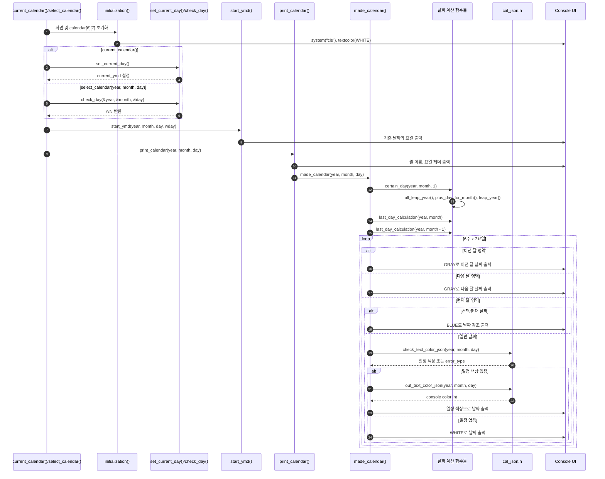
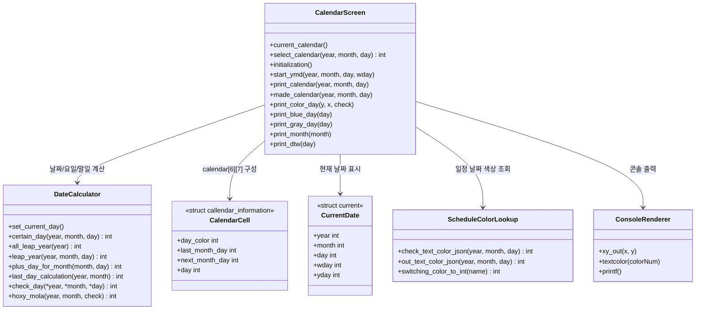

# 달력 생성 및 UI 표시 흐름

## Sequence Diagram

```mermaid
sequenceDiagram
    autonumber
    participant Caller as current_calendar()/select_calendar()
    participant Init as initialization()
    participant Date as set_current_day()/check_day()
    participant Header as start_ymd()
    participant Print as print_calendar()
    participant Maker as made_calendar()
    participant Calc as 날짜 계산 함수들
    participant Json as cal_json.h
    participant Console as Console UI

    Caller->>Init: 화면 및 calendar[6][7] 초기화
    Init->>Console: system("cls"), textcolor(WHITE)

    alt current_calendar()
        Caller->>Date: set_current_day()
        Date-->>Caller: current_ymd 설정
    else select_calendar(year, month, day)
        Caller->>Date: check_day(&year, &month, &day)
        Date-->>Caller: Y/N 반환
    end

    Caller->>Header: start_ymd(year, month, day, wday)
    Header->>Console: 기준 날짜와 요일 출력
    Caller->>Print: print_calendar(year, month, day)
    Print->>Console: 월 이름, 요일 헤더 출력
    Print->>Maker: made_calendar(year, month, day)
    Maker->>Calc: certain_day(year, month, 1)
    Calc->>Calc: all_leap_year(), plus_day_for_month(), leap_year()
    Maker->>Calc: last_day_calculation(year, month)
    Maker->>Calc: last_day_calculation(year, month - 1)

    loop 6주 x 7요일
        alt 이전 달 영역
            Maker->>Console: GRAY로 이전 달 날짜 출력
        else 다음 달 영역
            Maker->>Console: GRAY로 다음 달 날짜 출력
        else 현재 달 영역
            alt 선택/현재 날짜
                Maker->>Console: BLUE로 날짜 강조 출력
            else 일반 날짜
                Maker->>Json: check_text_color_json(year, month, day)
                Json-->>Maker: 일정 색상 또는 error_type
                alt 일정 색상 있음
                    Maker->>Json: out_text_color_json(year, month, day)
                    Json-->>Maker: console color int
                    Maker->>Console: 일정 색상으로 날짜 출력
                else 일정 없음
                    Maker->>Console: WHITE로 날짜 출력
                end
            end
        end
    end
```

## Class Diagram

```mermaid
classDiagram
    class CalendarScreen {
        +current_calendar()
        +select_calendar(year, month, day) int
        +initialization()
        +start_ymd(year, month, day, wday)
        +print_calendar(year, month, day)
        +made_calendar(year, month, day)
        +print_color_day(y, x, check)
        +print_blue_day(day)
        +print_gray_day(day)
        +print_month(month)
        +print_dtw(day)
    }

    class DateCalculator {
        +set_current_day()
        +certain_day(year, month, day) int
        +all_leap_year(year) int
        +leap_year(year, month, day) int
        +plus_day_for_month(month, day) int
        +last_day_calculation(year, month) int
        +check_day(*year, *month, *day) int
        +hoxy_mola(year, month, check) int
    }

    class CalendarCell {
        <<struct callendar_information>>
        +day_color int
        +last_month_day int
        +next_month_day int
        +day int
    }

    class CurrentDate {
        <<struct current>>
        +year int
        +month int
        +day int
        +wday int
        +yday int
    }

    class ScheduleColorLookup {
        +check_text_color_json(year, month, day) int
        +out_text_color_json(year, month, day) int
        +switching_color_to_int(name) int
    }

    class ConsoleRenderer {
        +xy_out(x, y)
        +textcolor(colorNum)
        +printf()
    }

    CalendarScreen --> DateCalculator : 날짜/요일/말일 계산
    CalendarScreen --> CalendarCell : calendar[6][7] 구성
    CalendarScreen --> CurrentDate : 현재 날짜 표시
    CalendarScreen --> ScheduleColorLookup : 일정 날짜 색상 조회
    CalendarScreen --> ConsoleRenderer : 콘솔 출력
```

