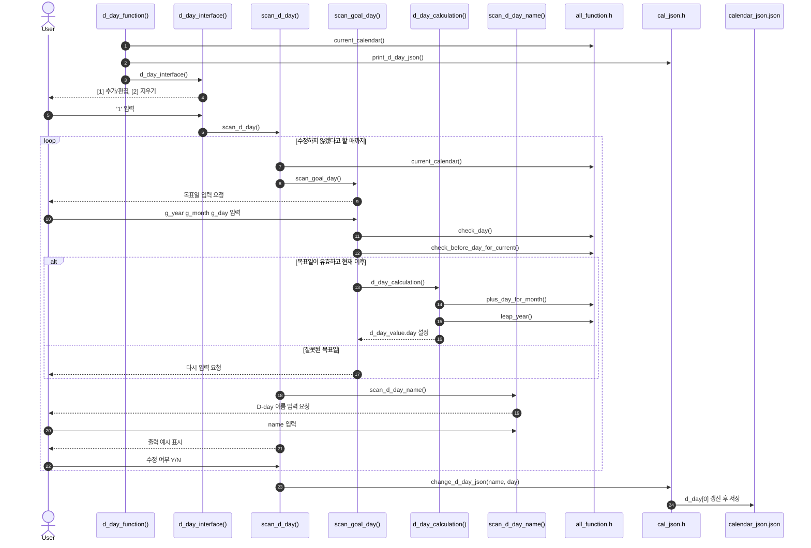
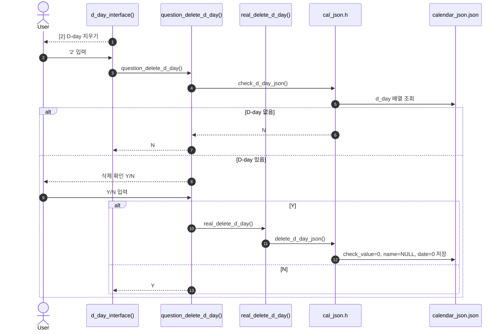
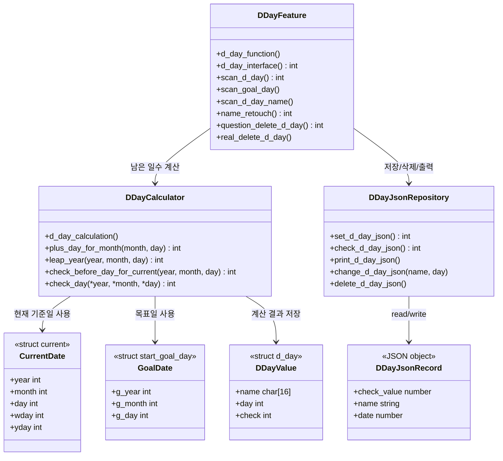

# 목표날짜 남은일 표시 및 계산

## Sequence Diagram: D-day 추가/편집

```mermaid
sequenceDiagram
    autonumber
    actor User
    participant DDay as d_day_function()
    participant Interface as d_day_interface()
    participant Scan as scan_d_day()
    participant Goal as scan_goal_day()
    participant Calc as d_day_calculation()
    participant Name as scan_d_day_name()
    participant Calendar as all_function.h
    participant Json as cal_json.h
    participant File as calendar_json.json

    DDay->>Calendar: current_calendar()
    DDay->>Json: print_d_day_json()
    DDay->>Interface: d_day_interface()
    Interface-->>User: [1] 추가/편집, [2] 지우기
    User->>Interface: '1' 입력
    Interface->>Scan: scan_d_day()

    loop 수정하지 않겠다고 할 때까지
        Scan->>Calendar: current_calendar()
        Scan->>Goal: scan_goal_day()
        Goal-->>User: 목표일 입력 요청
        User->>Goal: g_year g_month g_day 입력
        Goal->>Calendar: check_day()
        Goal->>Calendar: check_before_day_for_current()
        alt 목표일이 유효하고 현재 이후
            Goal->>Calc: d_day_calculation()
            Calc->>Calendar: plus_day_for_month()
            Calc->>Calendar: leap_year()
            Calc-->>Goal: d_day_value.day 설정
        else 잘못된 목표일
            Goal-->>User: 다시 입력 요청
        end
        Scan->>Name: scan_d_day_name()
        Name-->>User: D-day 이름 입력 요청
        User->>Name: name 입력
        Scan-->>User: 출력 예시 표시
        User->>Scan: 수정 여부 Y/N
    end

    Scan->>Json: change_d_day_json(name, day)
    Json->>File: d_day[0] 갱신 후 저장
```

## Sequence Diagram: D-day 삭제

```mermaid
sequenceDiagram
    autonumber
    actor User
    participant Interface as d_day_interface()
    participant DeleteQ as question_delete_d_day()
    participant Delete as real_delete_d_day()
    participant Json as cal_json.h
    participant File as calendar_json.json

    Interface-->>User: [2] D-day 지우기
    User->>Interface: '2' 입력
    Interface->>DeleteQ: question_delete_d_day()
    DeleteQ->>Json: check_d_day_json()
    Json->>File: d_day 배열 조회
    alt D-day 없음
        Json-->>DeleteQ: N
        DeleteQ-->>Interface: N
    else D-day 있음
        DeleteQ-->>User: 삭제 확인 Y/N
        User->>DeleteQ: Y/N 입력
        alt Y
            DeleteQ->>Delete: real_delete_d_day()
            Delete->>Json: delete_d_day_json()
            Json->>File: check_value=0, name=NULL, date=0 저장
        else N
            DeleteQ-->>Interface: Y
        end
    end
```

## Class Diagram

```mermaid
classDiagram
    class DDayFeature {
        +d_day_function()
        +d_day_interface() int
        +scan_d_day() int
        +scan_goal_day()
        +scan_d_day_name()
        +name_retouch() int
        +question_delete_d_day() int
        +real_delete_d_day()
    }

    class DDayCalculator {
        +d_day_calculation()
        +plus_day_for_month(month, day) int
        +leap_year(year, month, day) int
        +check_before_day_for_current(year, month, day) int
        +check_day(*year, *month, *day) int
    }

    class CurrentDate {
        <<struct current>>
        +year int
        +month int
        +day int
        +wday int
        +yday int
    }

    class GoalDate {
        <<struct start_goal_day>>
        +g_year int
        +g_month int
        +g_day int
    }

    class DDayValue {
        <<struct d_day>>
        +name char[16]
        +day int
        +check int
    }

    class DDayJsonRepository {
        +set_d_day_json() int
        +check_d_day_json() int
        +print_d_day_json()
        +change_d_day_json(name, day)
        +delete_d_day_json()
    }

    class DDayJsonRecord {
        <<JSON object>>
        +check_value number
        +name string
        +date number
    }

    DDayFeature --> DDayCalculator : 남은 일수 계산
    DDayFeature --> DDayJsonRepository : 저장/삭제/출력
    DDayCalculator --> CurrentDate : 현재 기준일 사용
    DDayCalculator --> GoalDate : 목표일 사용
    DDayCalculator --> DDayValue : 계산 결과 저장
    DDayJsonRepository --> DDayJsonRecord : read/write
```

