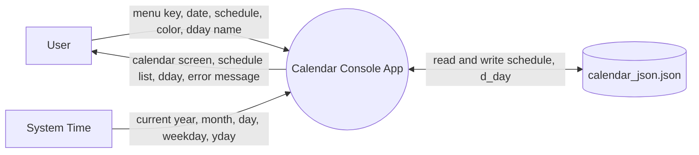
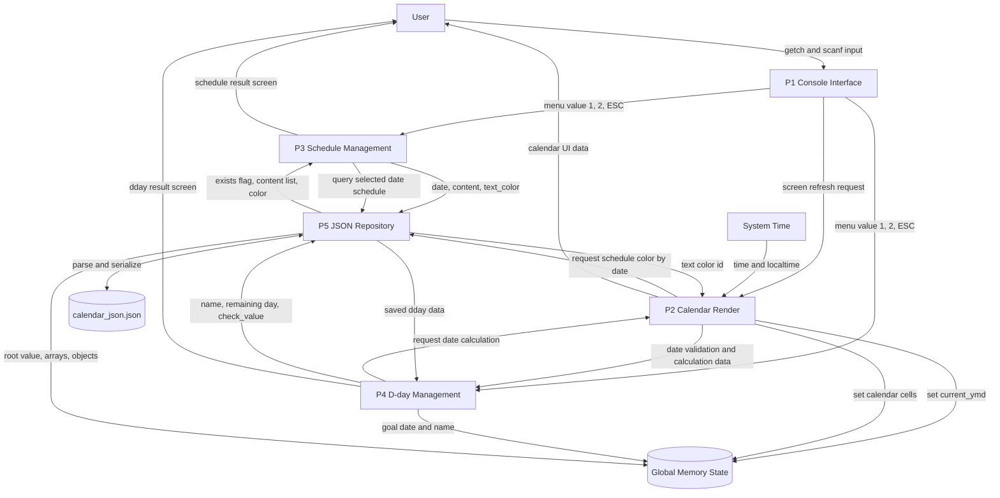
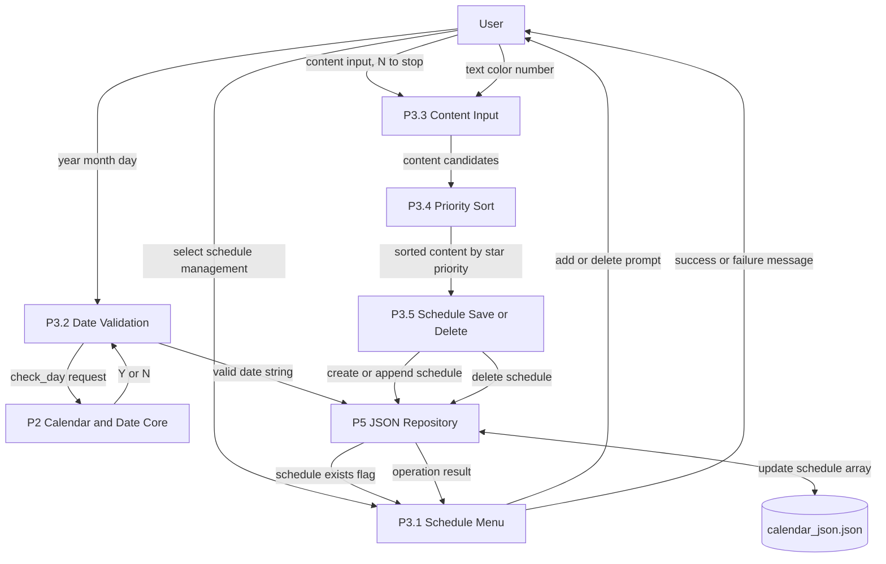
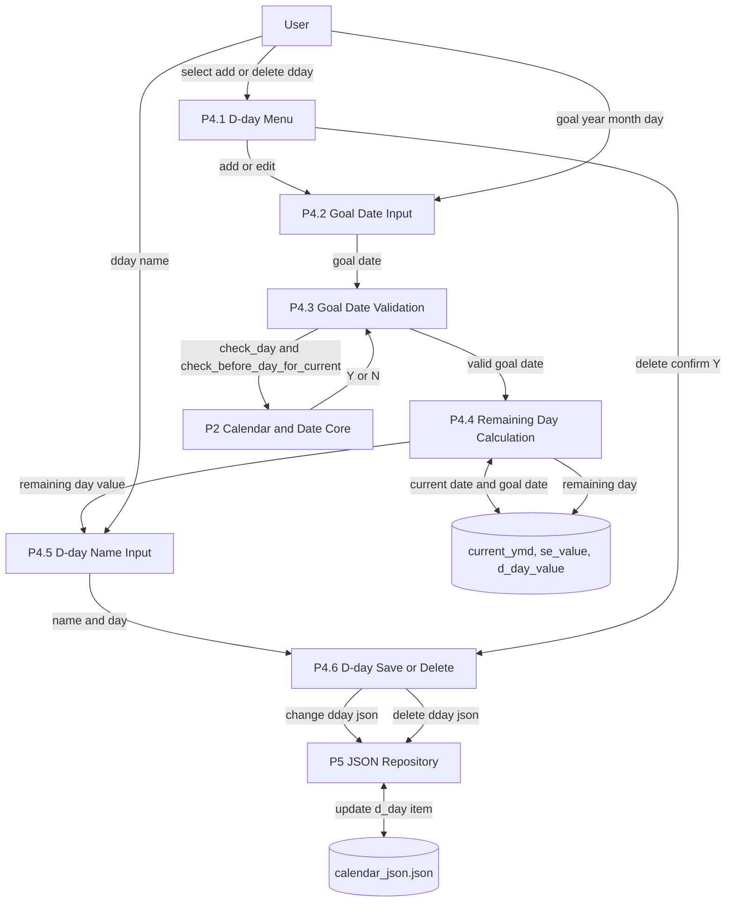
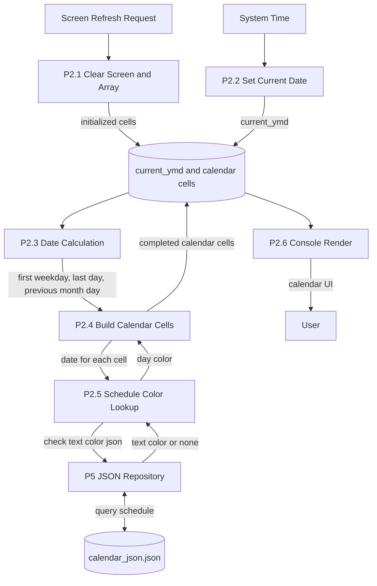

# DFD: Data Flow Diagram

Calendar project data flow diagrams.

## Level 0: Context Diagram

## Level 1: Overall Data Flow

## Level 2: Schedule Data Flow

## Level 2: D-day Data Flow

## Level 2: Calendar Render Data Flow

