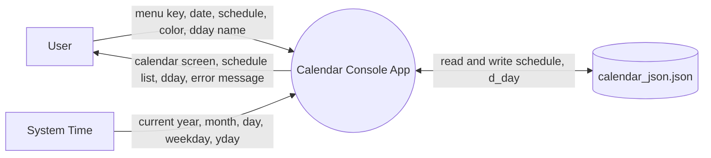
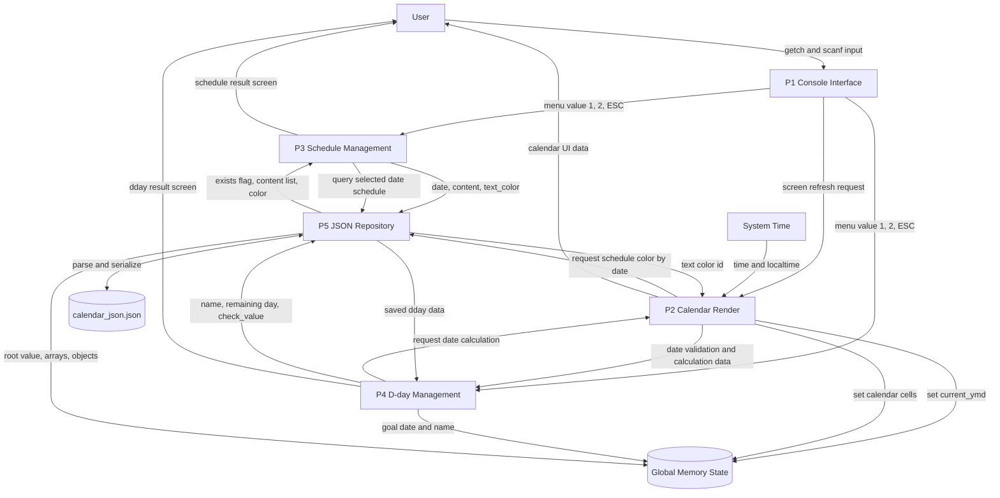
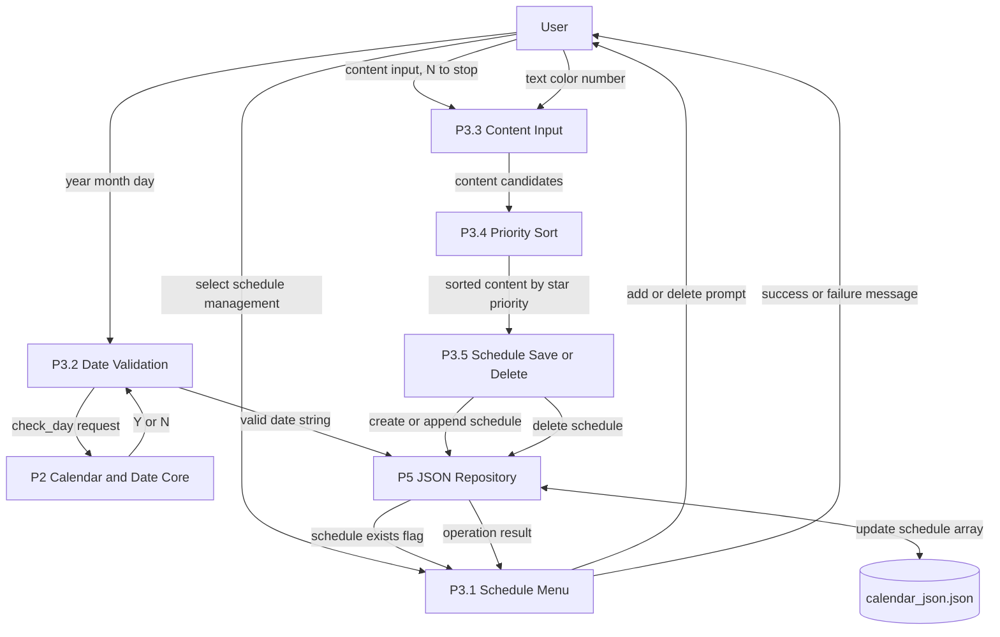
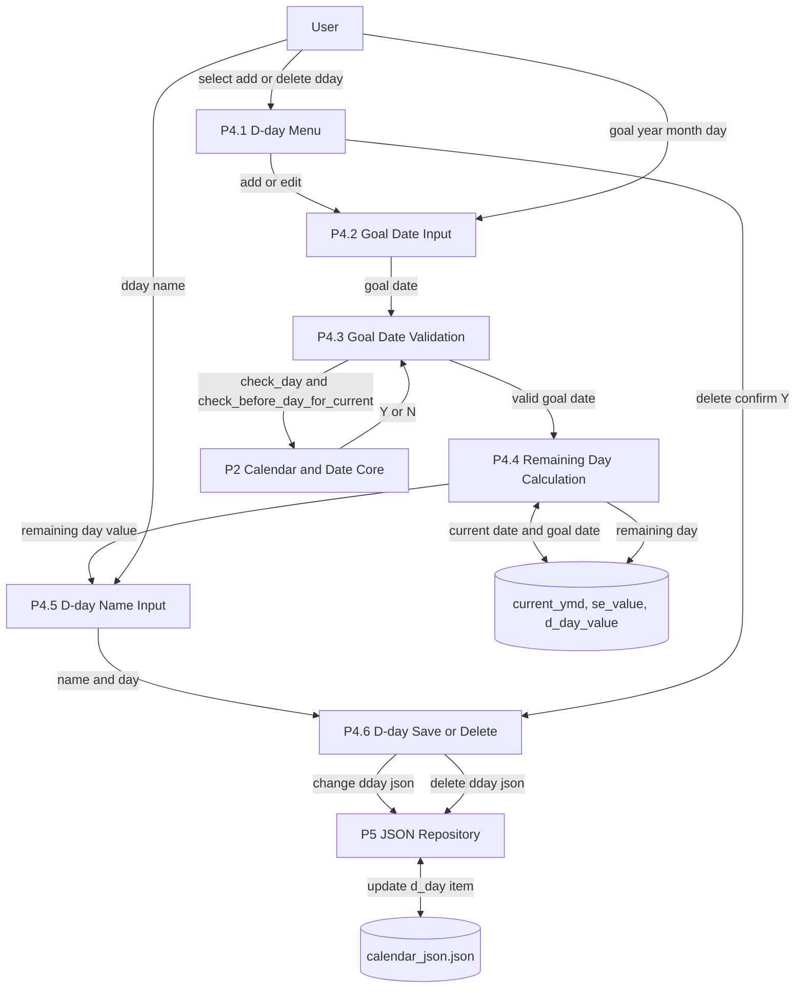
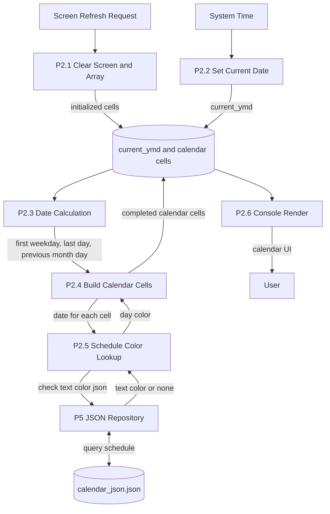

# DFD: Data Flow Diagram

DFD는 Data Flow Diagram의 약자이며, 프로그램 안에서 데이터가 어디서 들어오고, 어떤 처리 과정을 지나고, 어디에 저장되거나 출력되는지 보여주는 그림이다.

C 언어를 처음 배우는 관점에서는 다음처럼 보면 된다.

- `User`: 키보드로 값을 입력하는 사용자
- `System Time`: `time`, `localtime`으로 가져오는 현재 시간
- `Process`: 함수들이 하는 처리 과정
- `Data Store`: JSON 파일이나 전역 변수처럼 데이터를 담아두는 공간
- Arrow: 데이터가 이동하는 방향

이 프로젝트에서는 사용자가 입력한 날짜, 일정, D-day 이름이 함수들을 거쳐 `calendar_json.json`에 저장되고, 다시 읽혀서 콘솔 화면에 표시된다.

## Level 0: Context Diagram

Level 0은 가장 큰 관점의 그림이다.  
Calendar 프로그램을 하나의 큰 처리 상자로 보고, 바깥의 사용자, 시스템 시간, JSON 파일과 어떤 데이터를 주고받는지만 표현한다.

## Level 1: Overall Data Flow

Level 1은 Calendar 프로그램 내부를 주요 기능 단위로 나눈 그림이다.

이 프로젝트의 핵심 데이터 흐름은 다음과 같다.

- 사용자의 입력은 먼저 콘솔 인터페이스로 들어간다.
- 콘솔 인터페이스는 입력값에 따라 일정 관리 또는 D-day 관리 기능으로 흐름을 넘긴다.
- 달력 출력 기능은 시스템 시간과 JSON에 저장된 일정 색상을 사용해서 화면을 만든다.
- 일정과 D-day는 JSON Repository를 통해 `calendar_json.json`에 저장된다.
- `current_ymd`, `calendar cells`, `d_day_value` 같은 전역 상태는 실행 중 계산 결과를 임시로 들고 있는 메모리 저장소 역할을 한다.

## Level 2: Schedule Data Flow

이 그림은 일정 추가/삭제 과정에서 데이터가 어떻게 흐르는지 보여준다.

C 코드 기준으로 보면 `schedule_all_function.h`의 `add_schedule`, `delete_schedule`, `get_content` 흐름과 `cal_json.h`의 schedule 관련 함수들이 연결된다.

읽는 순서는 다음과 같다.

1. 사용자가 일정 관리 메뉴를 선택한다.
2. 날짜를 입력하면 `check_day`로 유효한 날짜인지 검사한다.
3. 새 일정이면 내용과 색상을 입력받는다.
4. 기존 일정이면 추가할 수 있는지 확인한 뒤 content를 더한다.
5. 최종 데이터는 JSON Repository를 통해 `calendar_json.json`의 `schedule` 배열에 저장된다.

## Level 2: D-day Data Flow

이 그림은 목표 날짜를 입력하고 남은 일수를 계산해서 저장하는 흐름이다.

C 코드 기준으로는 `d_day_all_function.h`의 `scan_d_day`, `scan_goal_day`, `d_day_calculation`, `scan_d_day_name`이 중심이다.

핵심은 다음과 같다.

- 사용자가 목표 날짜를 입력한다.
- 날짜가 올바른지, 현재 날짜보다 미래인지 검사한다.
- 현재 날짜와 목표 날짜를 비교해서 남은 일수를 계산한다.
- 사용자가 입력한 이름과 계산된 남은 일수를 `d_day` 데이터로 JSON 파일에 저장한다.

## Level 2: Calendar Render Data Flow

이 그림은 콘솔에 달력이 표시될 때 필요한 데이터 흐름이다.

`current_calendar` 또는 `select_calendar`가 호출되면 화면을 초기화하고, 현재 날짜 또는 선택 날짜를 기준으로 `calendar cells`를 만든다. 각 날짜에 일정이 있으면 JSON에서 색상 정보를 가져와서 해당 날짜를 다른 색으로 출력한다.

입문자 관점에서 중요한 점은 달력 출력이 단순히 `printf`만 하는 것이 아니라는 점이다.

- 현재 날짜를 가져온다.
- 해당 월의 1일 요일과 말일을 계산한다.
- 이전 달/현재 달/다음 달 날짜를 6 x 7 칸에 배치한다.
- 일정이 있는 날짜는 JSON에서 색상을 조회한다.
- 최종 결과를 콘솔에 출력한다.

