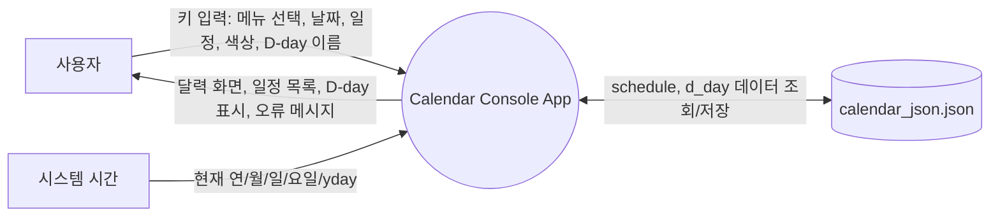
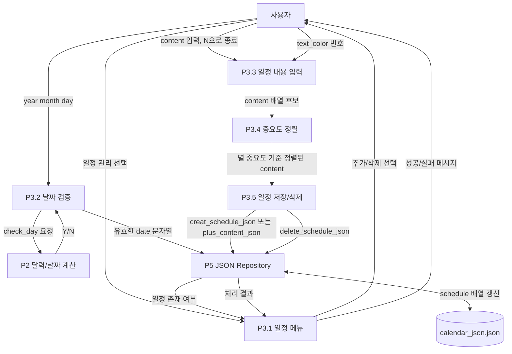

# DFD: Data Flow Diagram

이 문서는 Calendar 프로젝트의 데이터 흐름을 DFD 관점으로 정리한다.

- External Entity: 사용자, 시스템 시간
- Process: 콘솔 인터페이스, 달력 생성, 일정 관리, D-day 관리, JSON 저장소 처리
- Data Store: `calendar_json.json`, 메모리 전역 상태

## Level 0: Context Diagram



## Level 1: 전체 데이터 흐름

```mermaid
flowchart TB
    User[사용자]
    Time[시스템 시간]
    Console[P1 콘솔 인터페이스]
    Calendar[P2 달력 생성 및 표시]
    Schedule[P3 일정 관리]
    DDay[P4 D-day 관리]
    JsonRepo[P5 JSON Repository]
    Memory[(메모리 전역 상태)]
    JsonFile[(calendar_json.json)]

    User -->|_getch, scanf 입력| Console
    Console -->|메뉴 선택값: 1, 2, ESC| Schedule
    Console -->|메뉴 선택값: 1, 2, ESC| DDay
    Console -->|초기/반복 화면 요청| Calendar

    Time -->|time(), localtime()| Calendar
    Calendar -->|current_ymd 설정| Memory
    Calendar -->|calendar[6][7] 셀 정보 설정| Memory
    Calendar -->|일정 색상 조회 요청: year/month/day| JsonRepo
    JsonRepo -->|text_color int| Calendar
    Calendar -->|달력 UI 출력 데이터| User

    Schedule -->|날짜, content, text_color| JsonRepo
    Schedule -->|선택 날짜 일정 조회| JsonRepo
    JsonRepo -->|일정 존재 여부, content 목록, 색상| Schedule
    Schedule -->|일정 입력/삭제 결과 화면| User

    DDay -->|목표 날짜, 이름| Memory
    DDay -->|현재 날짜 기준 계산 요청| Calendar
    Calendar -->|날짜 유효성, 남은 일 계산 재료| DDay
    DDay -->|name, remaining day, check_value| JsonRepo
    JsonRepo -->|D-day 저장값| DDay
    DDay -->|D-day 출력/삭제 결과 화면| User

    JsonRepo <-->|parse/serialize| JsonFile
    JsonRepo -->|rootValue, arrays, objects| Memory
```

## Level 2: 일정 관리 데이터 흐름



## Level 2: D-day 데이터 흐름

```mermaid
flowchart TB
    User[사용자]
    DDayUI[P4.1 D-day 메뉴]
    GoalInput[P4.2 목표일 입력]
    GoalCheck[P4.3 목표일 검증]
    DDayCalc[P4.4 남은 일 계산]
    NameInput[P4.5 이름 입력]
    DDayStore[P4.6 D-day 저장/삭제]
    CalendarCore[P2 달력/날짜 계산]
    Memory[(current_ymd, se_value, d_day_value)]
    JsonRepo[P5 JSON Repository]
    JsonFile[(calendar_json.json)]

    User -->|D-day 추가/삭제 선택| DDayUI
    DDayUI -->|추가/편집| GoalInput
    User -->|g_year g_month g_day| GoalInput
    GoalInput -->|목표 날짜| GoalCheck
    GoalCheck -->|check_day, check_before_day_for_current| CalendarCore
    CalendarCore -->|Y/N| GoalCheck
    GoalCheck -->|유효한 목표일| DDayCalc
    DDayCalc <-->|current_ymd, se_value| Memory
    DDayCalc -->|d_day_value.day| Memory

    DDayCalc -->|남은 일수| NameInput
    User -->|D-day name| NameInput
    NameInput -->|name, day| DDayStore
    DDayStore -->|change_d_day_json| JsonRepo
    DDayUI -->|삭제 확인 Y| DDayStore
    DDayStore -->|delete_d_day_json| JsonRepo
    JsonRepo <-->|d_day[0] 갱신| JsonFile
```

## Level 2: 달력 표시 데이터 흐름

```mermaid
flowchart TB
    Time[시스템 시간]
    Request[화면 갱신 요청]
    Init[P2.1 화면/배열 초기화]
    Current[P2.2 현재 날짜 설정]
    DateCalc[P2.3 날짜 계산]
    CalendarBuild[P2.4 calendar[6][7] 구성]
    ColorLookup[P2.5 일정 색상 조회]
    Render[P2.6 콘솔 출력]
    JsonRepo[P5 JSON Repository]
    Memory[(current_ymd, calendar[6][7])]
    JsonFile[(calendar_json.json)]
    User[사용자]

    Request --> Init
    Init -->|초기화된 calendar 배열| Memory
    Time --> Current
    Current -->|current_ymd| Memory
    Memory --> DateCalc
    DateCalc -->|first_dtw, last_day, last_month_day| CalendarBuild
    CalendarBuild -->|각 날짜별 year/month/day| ColorLookup
    ColorLookup -->|check_text_color_json| JsonRepo
    JsonRepo <-->|schedule 조회| JsonFile
    JsonRepo -->|text_color 또는 없음| ColorLookup
    ColorLookup -->|day_color| CalendarBuild
    CalendarBuild -->|calendar[6][7] 완성| Memory
    Memory --> Render
    Render -->|달력 UI| User
```

