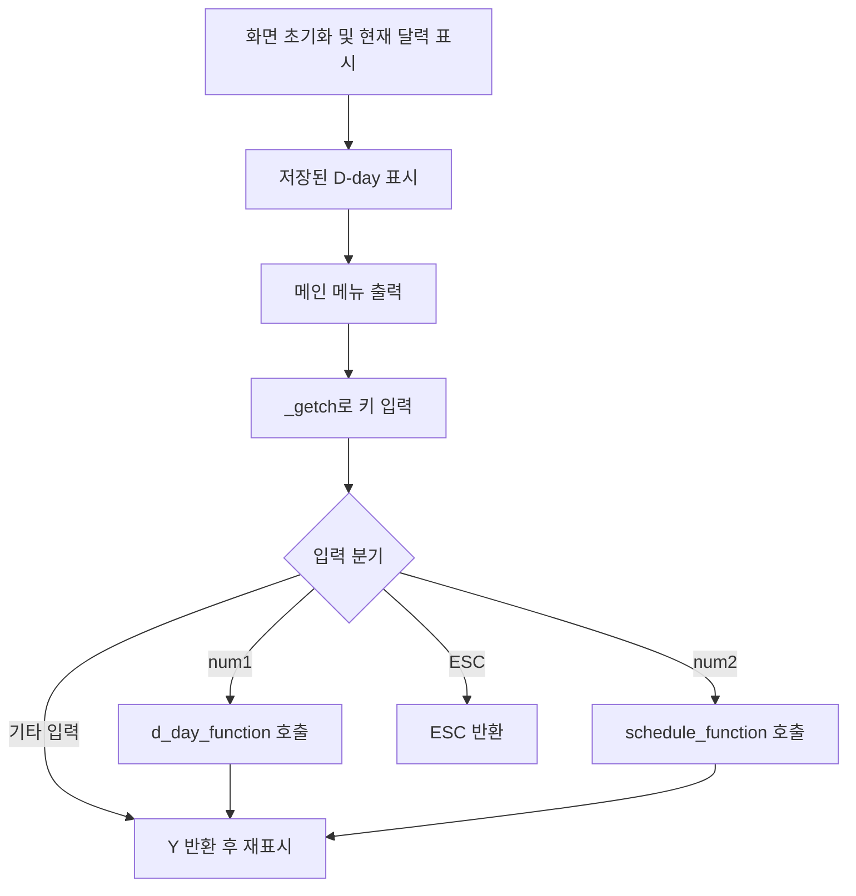
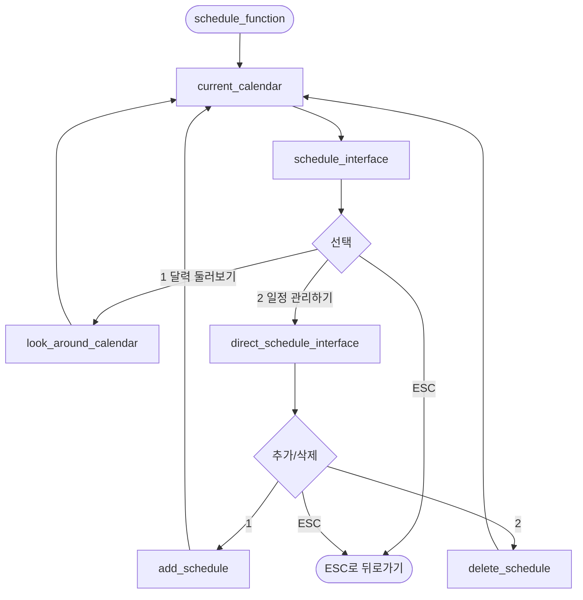
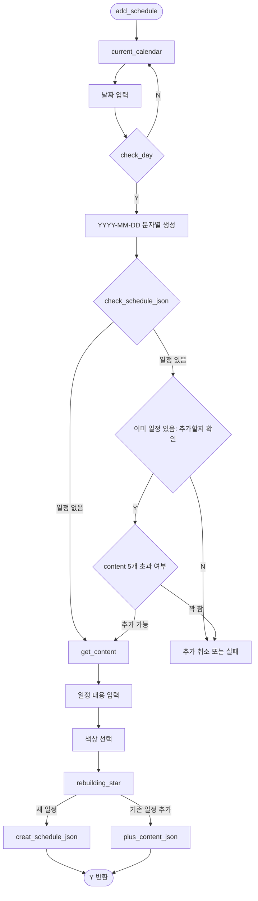
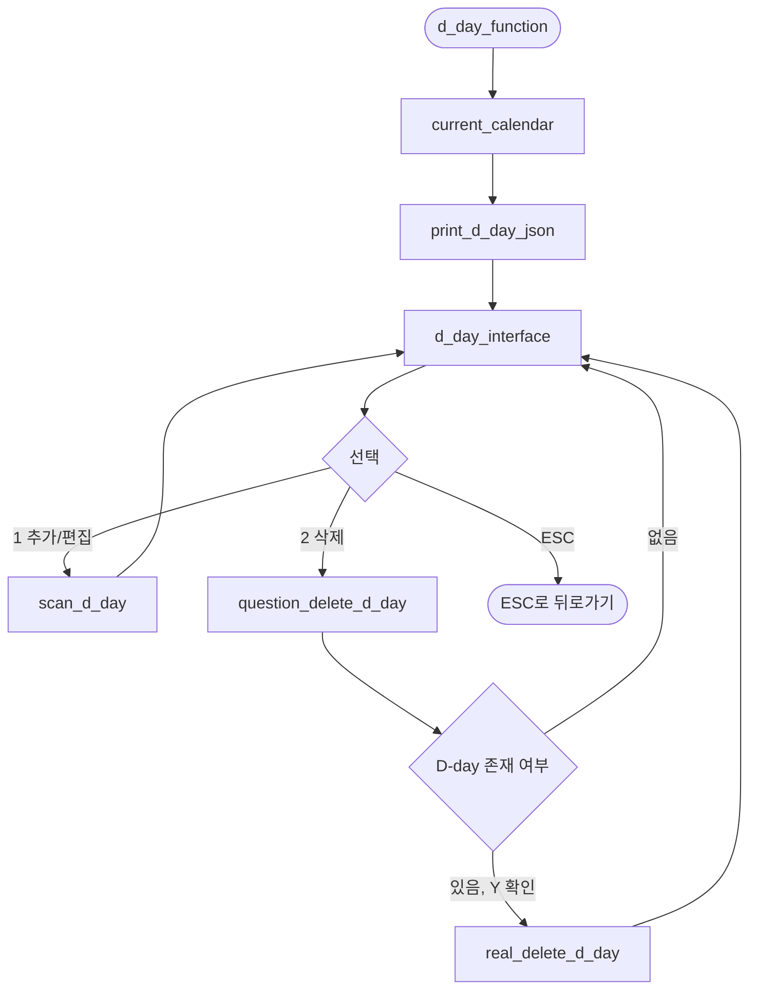
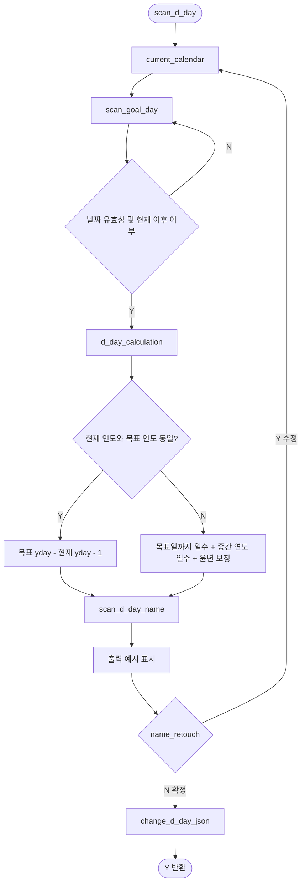
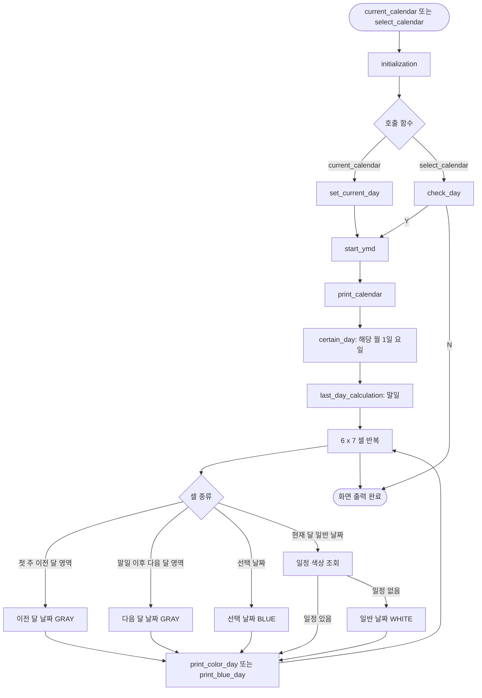
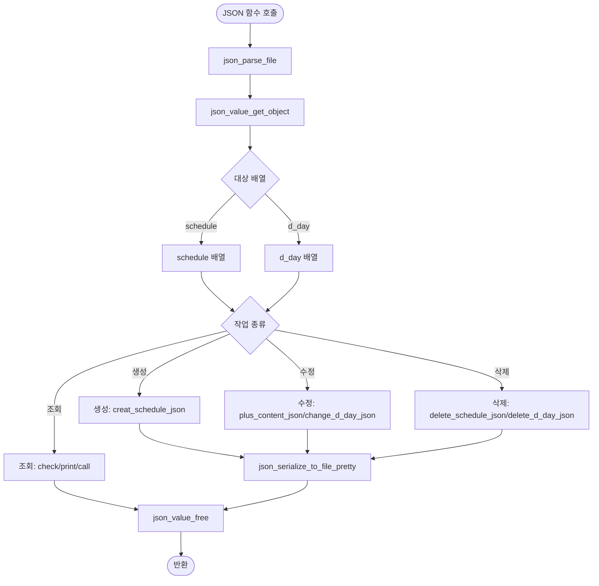

# DPD: Data Process Diagram

이 문서는 Calendar 프로젝트의 처리 절차를 DPD 관점으로 정리한다.  
DFD가 데이터 이동을 중심으로 본다면, DPD는 각 기능이 어떤 프로세스 단계로 분해되는지에 초점을 둔다.

## 전체 프로세스 분해도

```mermaid
flowchart TB
    Start([프로그램 시작])
    Main[main()]
    SelectFunction[select_function()]
    DrawCurrent[current_calendar()]
    PrintDDay[print_d_day_json()]
    MainMenu[select_interface()]
    CheckInput{입력값}
    DDayFlow[D-day 프로세스]
    ScheduleFlow[일정 프로세스]
    Refresh[화면 갱신]
    End([프로그램 종료])

    Start --> Main
    Main --> SelectFunction
    SelectFunction --> DrawCurrent
    DrawCurrent --> PrintDDay
    PrintDDay --> MainMenu
    MainMenu --> CheckInput

    CheckInput -->|1| DDayFlow
    CheckInput -->|2| ScheduleFlow
    CheckInput -->|ESC| End
    CheckInput -->|그 외| Refresh

    DDayFlow --> Refresh
    ScheduleFlow --> Refresh
    Refresh --> DrawCurrent
```

## Interface 프로세스



## 일정 관리 프로세스



## 일정 추가 세부 프로세스



## D-day 프로세스



## D-day 계산 세부 프로세스



## 달력 생성 프로세스



## JSON 처리 프로세스



