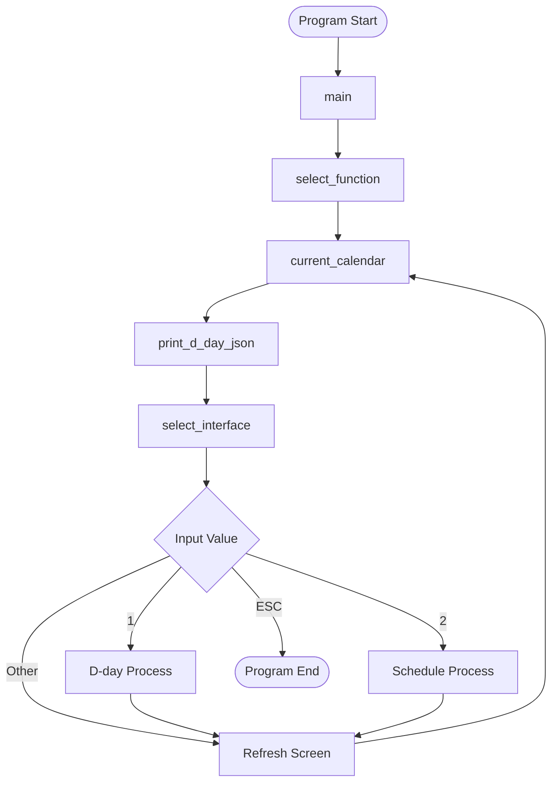
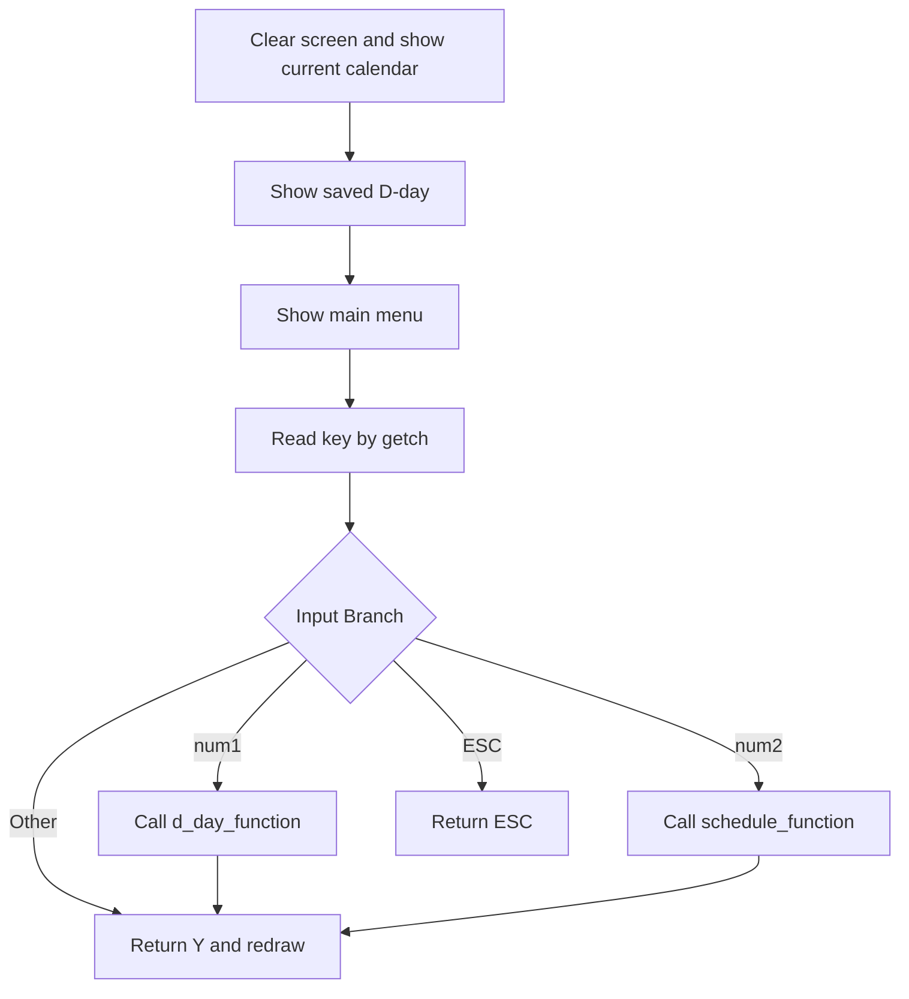
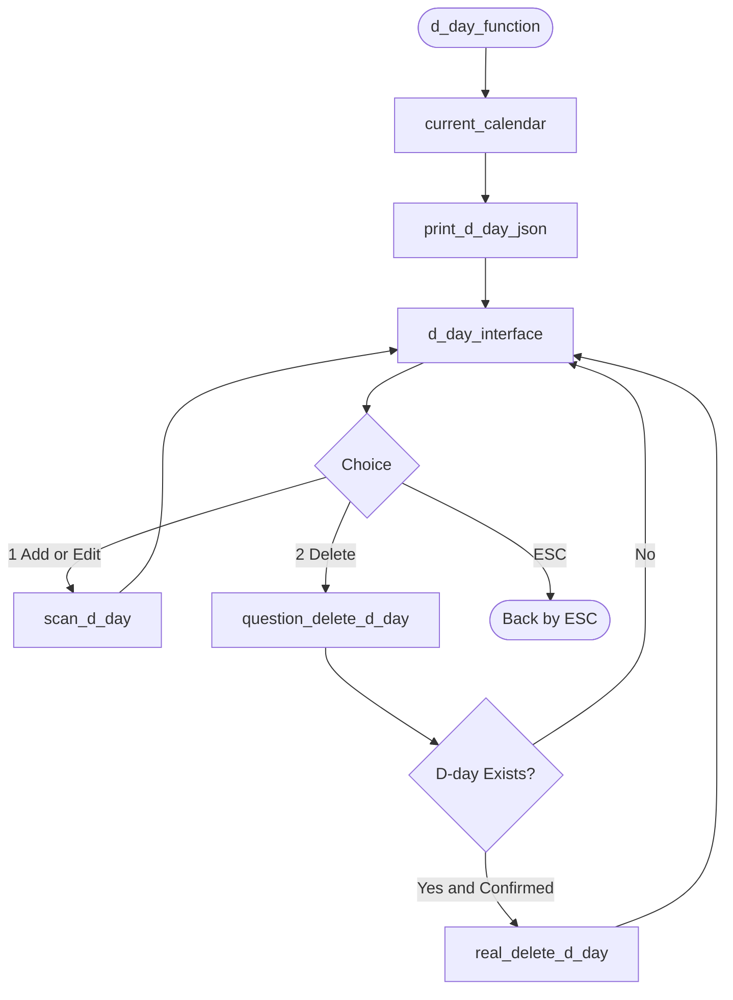
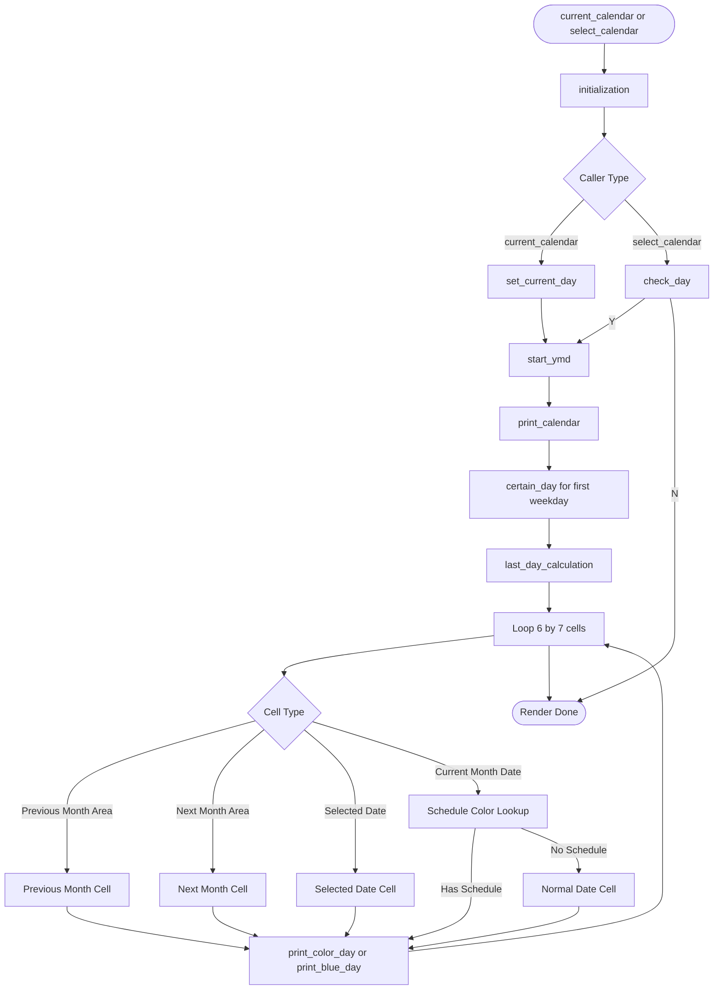
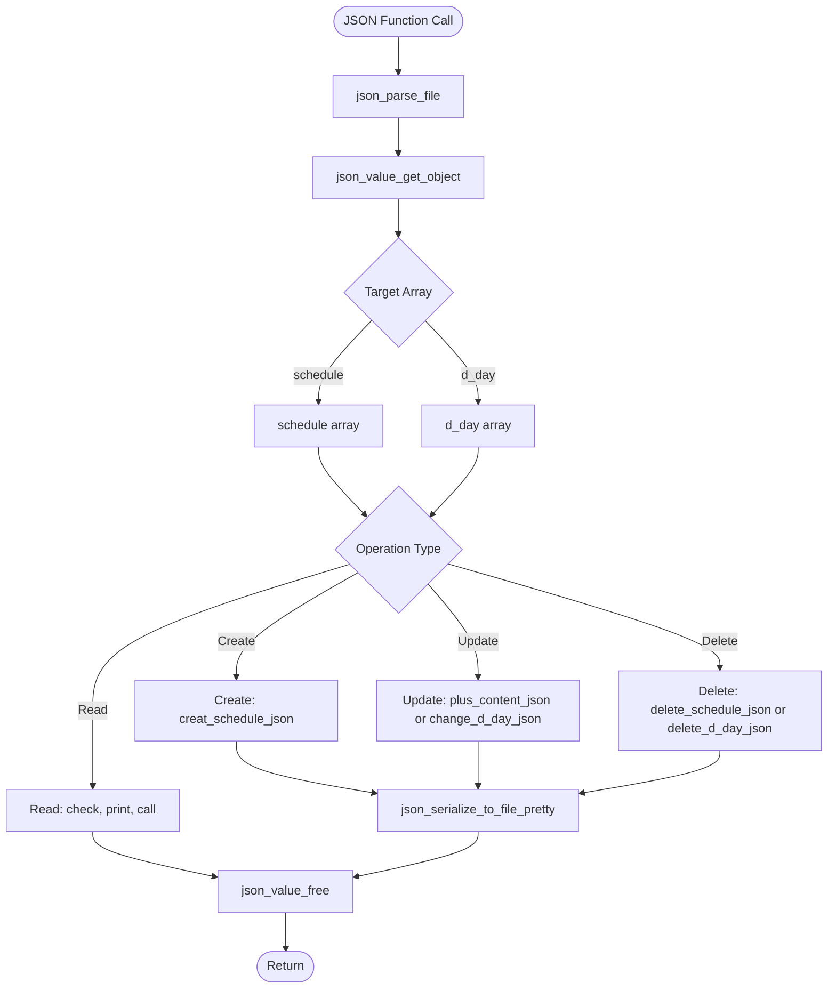

# DPD: Data Process Diagram

Calendar project process decomposition diagrams.

## Overall Process

## Interface Process

## Schedule Management Process

## Schedule Add Detail Process

## D-day Process

## D-day Calculation Detail Process

## Calendar Build Process

## JSON Process

