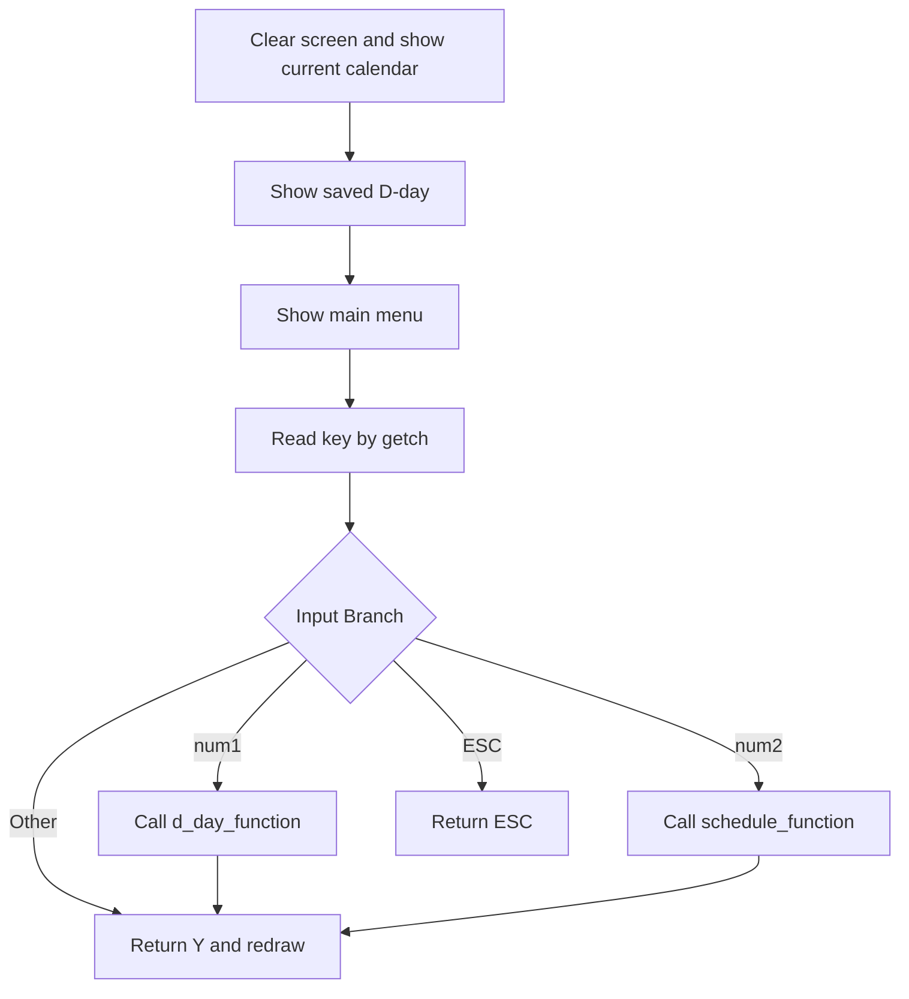
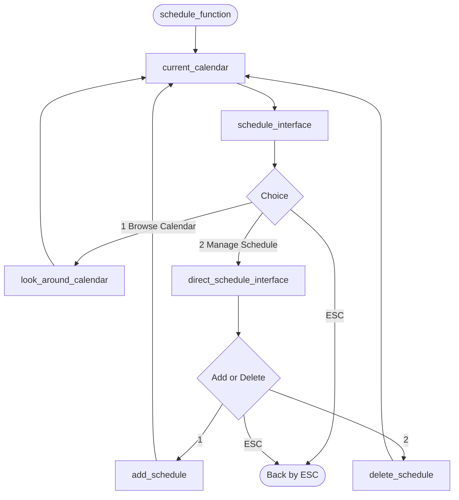
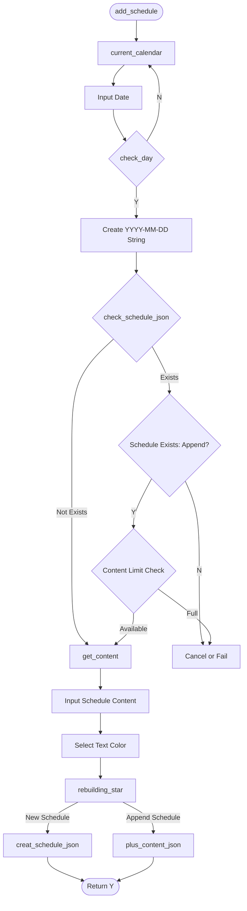
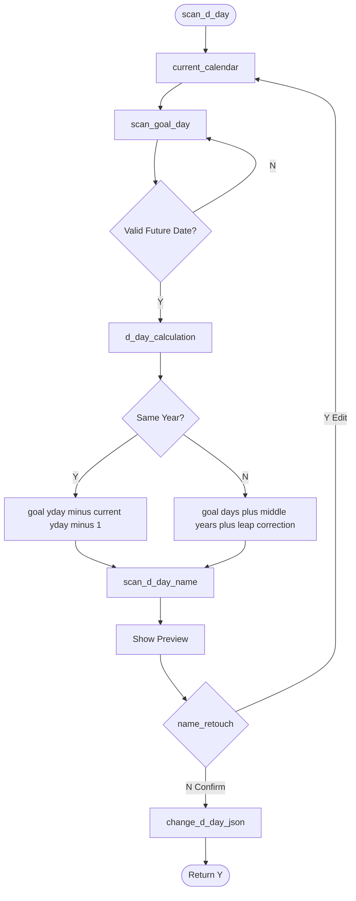

# DPD: Data Process Diagram

DPD는 Data Process Diagram의 약자이며, 프로그램의 기능을 처리 단계 중심으로 쪼개서 보여주는 그림이다.

DFD가 "데이터가 어디로 흐르는가"를 본다면, DPD는 "함수가 어떤 순서로 일을 처리하는가"를 본다.

C 언어를 배우는 관점에서는 DPD를 함수 호출 흐름도로 생각하면 이해하기 쉽다.

- 사각형 노드: 하나의 처리 단계 또는 함수
- 마름모 노드: 조건문, 메뉴 선택, 분기
- 화살표: 다음에 실행되는 단계
- 시작/종료 노드: 기능의 진입점과 종료점

이 문서의 다이어그램은 실제 코드의 함수 이름을 최대한 반영해서 작성했다.

## Overall Process

전체 프로세스는 `main`에서 시작해서 `select_function`으로 들어간다.  
`select_function`은 현재 달력과 D-day를 먼저 출력한 뒤, 사용자가 ESC를 누르기 전까지 메인 메뉴를 반복한다.

이 흐름은 `calendar.c`의 핵심 구조와 같다.

1. 프로그램 시작
2. 현재 달력 출력
3. 저장된 D-day 출력
4. 메뉴 입력 대기
5. 입력값에 따라 D-day 또는 일정 기능 실행
6. 기능 처리 후 화면 갱신
7. ESC 입력 시 종료

## Interface Process

Interface 프로세스는 메뉴를 보여주고 사용자의 키 입력을 기능 함수로 연결하는 역할이다.

이 프로젝트에서는 `_getch`로 키 하나를 입력받는다.  
`num1`이면 D-day 기능, `num2`이면 일정 기능, `ESC`이면 뒤로가기 또는 종료 흐름으로 이어진다.

즉, 이 부분은 사용자의 입력과 실제 기능 함수를 연결하는 라우터 역할을 한다.

## Schedule Management Process

일정 관리 프로세스는 크게 두 갈래다.

- 달력 둘러보기: 날짜를 이동하면서 해당 날짜의 일정을 조회한다.
- 일정 관리하기: 일정을 추가하거나 삭제한다.

코드에서는 `schedule_function`이 전체 루프를 담당하고, `schedule_interface`가 사용자의 선택을 받아 `look_around_calendar` 또는 `direct_schedule_interface`로 넘긴다.

## Schedule Add Detail Process

일정 추가 세부 프로세스는 사용자 입력과 JSON 저장이 섞여 있기 때문에 단계가 많다.

초보자가 볼 때는 다음 순서로 이해하면 좋다.

1. 날짜를 입력받는다.
2. `check_day`로 유효한 날짜인지 검사한다.
3. 해당 날짜에 이미 일정이 있는지 확인한다.
4. 새 일정이면 내용과 색상을 입력받는다.
5. 기존 일정이면 최대 5개 제한을 확인한 뒤 추가 입력을 받는다.
6. `rebuilding_star`로 중요도 표시가 있는 일정을 앞쪽으로 정렬한다.
7. JSON 파일에 새로 만들거나 기존 content 배열에 추가한다.

여기서 `creat_schedule_json`은 새 날짜 객체를 만드는 함수이고, `plus_content_json`은 기존 날짜 객체의 content 배열에 일정을 추가하는 함수다.

## D-day Process

D-day 프로세스는 D-day를 추가/편집하거나 삭제하는 메뉴 흐름이다.

사용자가 추가/편집을 선택하면 `scan_d_day`로 들어가 목표 날짜와 이름을 입력받는다.  
삭제를 선택하면 `question_delete_d_day`에서 먼저 저장된 D-day가 있는지 확인하고, 사용자가 Y로 확인했을 때만 실제 삭제를 수행한다.

## D-day Calculation Detail Process

D-day 계산 세부 프로세스는 목표 날짜까지 남은 일수를 계산하는 과정이다.

현재 연도와 목표 연도가 같으면 같은 해 안에서 날짜 차이만 계산한다.  
연도가 다르면 목표일까지의 일수, 중간 연도의 일수, 윤년 보정을 더해서 남은 일수를 계산한다.

이 흐름은 `d_day_calculation` 함수의 핵심 로직을 단계별로 풀어 쓴 것이다.

## Calendar Build Process

달력 생성 프로세스는 화면에 달력을 그리기 전 필요한 계산 과정을 보여준다.

`current_calendar`는 현재 날짜 기준 달력을 만들고, `select_calendar`는 사용자가 선택한 날짜 기준 달력을 만든다.  
둘 다 내부적으로는 화면 초기화, 날짜 검증 또는 현재 날짜 설정, 달력 헤더 출력, 날짜 칸 생성, 색상 적용, 콘솔 출력 순서로 진행된다.

중요한 처리 단계는 다음과 같다.

- `certain_day`: 해당 월 1일의 요일 계산
- `last_day_calculation`: 해당 월의 마지막 날짜 계산
- `BuildLoop`: 6주 x 7요일 칸을 반복하면서 날짜 배치
- `ScheduleColor`: 일정이 있는 날짜인지 JSON에서 확인
- `Render`: 색상에 맞게 콘솔 출력

## JSON Process

JSON 처리 프로세스는 `cal_json.h` 안의 함수들이 공통적으로 따르는 흐름이다.

대부분의 JSON 함수는 다음 순서로 동작한다.

1. `json_parse_file`로 `calendar_json.json`을 읽는다.
2. root object를 가져온다.
3. 필요한 배열인 `schedule` 또는 `d_day`를 선택한다.
4. 조회, 생성, 수정, 삭제 중 필요한 작업을 수행한다.
5. 변경이 있으면 파일에 다시 저장한다.
6. 마지막에 `json_value_free`로 메모리를 해제한다.

C에서 파일 기반 데이터를 다룰 때는 읽기, 수정, 저장, 해제 순서가 명확해야 한다. 이 프로젝트도 그 흐름을 JSON Repository 역할의 함수들로 처리하고 있다.

