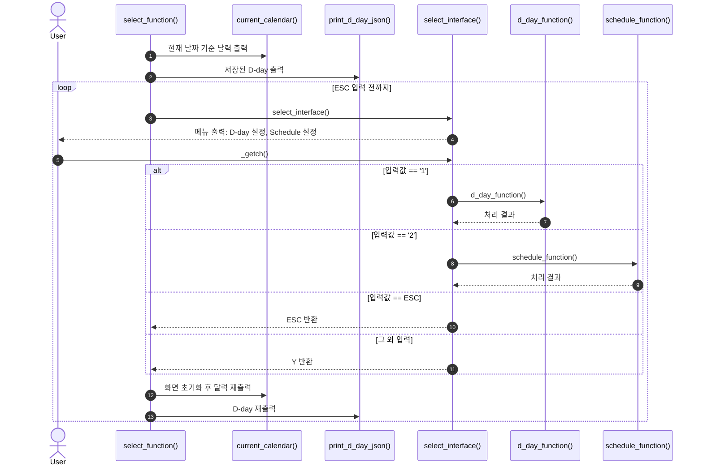
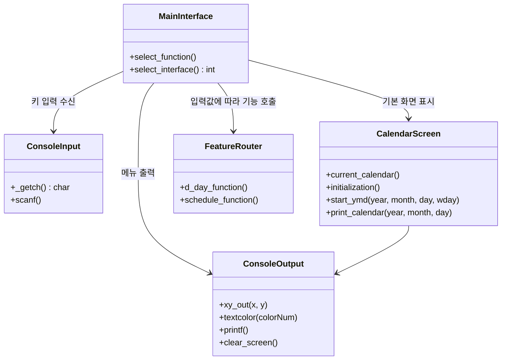

# Interface 흐름

## Sequence Diagram

```mermaid
sequenceDiagram
    autonumber
    actor User
    participant App as select_function()
    participant Calendar as current_calendar()
    participant DDayView as print_d_day_json()
    participant Menu as select_interface()
    participant DDay as d_day_function()
    participant Schedule as schedule_function()

    App->>Calendar: 현재 날짜 기준 달력 출력
    App->>DDayView: 저장된 D-day 출력

    loop ESC 입력 전까지
        App->>Menu: select_interface()
        Menu-->>User: 메뉴 출력: D-day 설정, Schedule 설정
        User->>Menu: _getch()

        alt 입력값 == '1'
            Menu->>DDay: d_day_function()
            DDay-->>Menu: 처리 결과
        else 입력값 == '2'
            Menu->>Schedule: schedule_function()
            Schedule-->>Menu: 처리 결과
        else 입력값 == ESC
            Menu-->>App: ESC 반환
        else 그 외 입력
            Menu-->>App: Y 반환
        end

        App->>Calendar: 화면 초기화 후 달력 재출력
        App->>DDayView: D-day 재출력
    end
```

## Class Diagram

```mermaid
classDiagram
    class MainInterface {
        +select_function()
        +select_interface() int
    }

    class ConsoleInput {
        +_getch() char
        +scanf()
    }

    class ConsoleOutput {
        +xy_out(x, y)
        +textcolor(colorNum)
        +printf()
        +clear_screen()
    }

    class CalendarScreen {
        +current_calendar()
        +initialization()
        +start_ymd(year, month, day, wday)
        +print_calendar(year, month, day)
    }

    class FeatureRouter {
        +d_day_function()
        +schedule_function()
    }

    MainInterface --> CalendarScreen : 기본 화면 표시
    MainInterface --> ConsoleOutput : 메뉴 출력
    MainInterface --> ConsoleInput : 키 입력 수신
    MainInterface --> FeatureRouter : 입력값에 따라 기능 호출
    CalendarScreen --> ConsoleOutput
```
