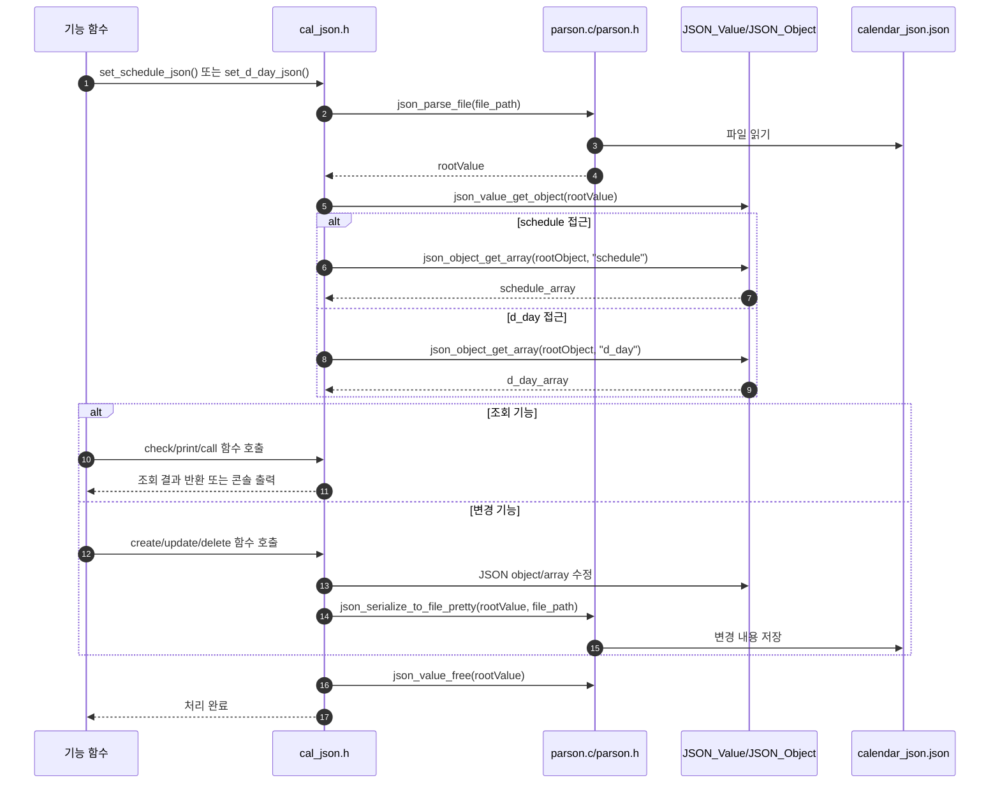
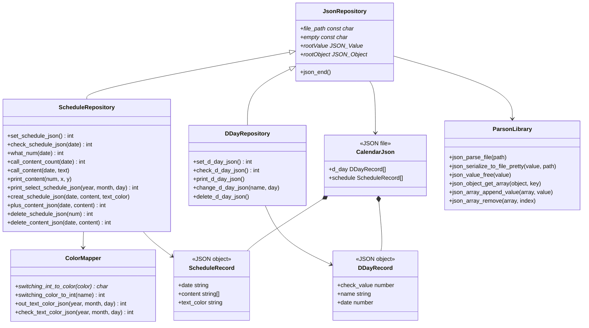

# JSON 데이터 저장 흐름

## Sequence Diagram

```mermaid
sequenceDiagram
    autonumber
    participant Feature as 기능 함수
    participant Repo as cal_json.h
    participant Parson as parson.c/parson.h
    participant Root as JSON_Value/JSON_Object
    participant File as calendar_json.json

    Feature->>Repo: set_schedule_json() 또는 set_d_day_json()
    Repo->>Parson: json_parse_file(file_path)
    Parson->>File: 파일 읽기
    Parson-->>Repo: rootValue
    Repo->>Root: json_value_get_object(rootValue)

    alt schedule 접근
        Repo->>Root: json_object_get_array(rootObject, "schedule")
        Root-->>Repo: schedule_array
    else d_day 접근
        Repo->>Root: json_object_get_array(rootObject, "d_day")
        Root-->>Repo: d_day_array
    end

    alt 조회 기능
        Feature->>Repo: check/print/call 함수 호출
        Repo-->>Feature: 조회 결과 반환 또는 콘솔 출력
    else 변경 기능
        Feature->>Repo: create/update/delete 함수 호출
        Repo->>Root: JSON object/array 수정
        Repo->>Parson: json_serialize_to_file_pretty(rootValue, file_path)
        Parson->>File: 변경 내용 저장
    end

    Repo->>Parson: json_value_free(rootValue)
    Repo-->>Feature: 처리 완료
```

## Class Diagram

```mermaid
classDiagram
    class JsonRepository {
        +file_path const char*
        +empty const char*
        +rootValue JSON_Value*
        +rootObject JSON_Object*
        +json_end()
    }

    class ScheduleRepository {
        +set_schedule_json() int
        +check_schedule_json(date) int
        +what_num(date) int
        +call_content_count(date) int
        +call_content(date, text)
        +print_content(num, x, y)
        +print_select_schedule_json(year, month, day) int
        +creat_schedule_json(date, content, text_color)
        +plus_content_json(date, content) int
        +delete_schedule_json(num) int
        +delete_content_json(date, content) int
    }

    class DDayRepository {
        +set_d_day_json() int
        +check_d_day_json() int
        +print_d_day_json()
        +change_d_day_json(name, day)
        +delete_d_day_json()
    }

    class ColorMapper {
        +switching_int_to_color(color) char*
        +switching_color_to_int(name) int
        +out_text_color_json(year, month, day) int
        +check_text_color_json(year, month, day) int
    }

    class CalendarJson {
        <<JSON file>>
        +d_day DDayRecord[]
        +schedule ScheduleRecord[]
    }

    class DDayRecord {
        <<JSON object>>
        +check_value number
        +name string
        +date number
    }

    class ScheduleRecord {
        <<JSON object>>
        +date string
        +content string[]
        +text_color string
    }

    class ParsonLibrary {
        +json_parse_file(path)
        +json_serialize_to_file_pretty(value, path)
        +json_value_free(value)
        +json_object_get_array(object, key)
        +json_array_append_value(array, value)
        +json_array_remove(array, index)
    }

    JsonRepository <|-- ScheduleRepository
    JsonRepository <|-- DDayRepository
    ScheduleRepository --> ColorMapper
    ScheduleRepository --> ScheduleRecord
    DDayRepository --> DDayRecord
    JsonRepository --> CalendarJson
    JsonRepository --> ParsonLibrary
    CalendarJson *-- DDayRecord
    CalendarJson *-- ScheduleRecord
```

