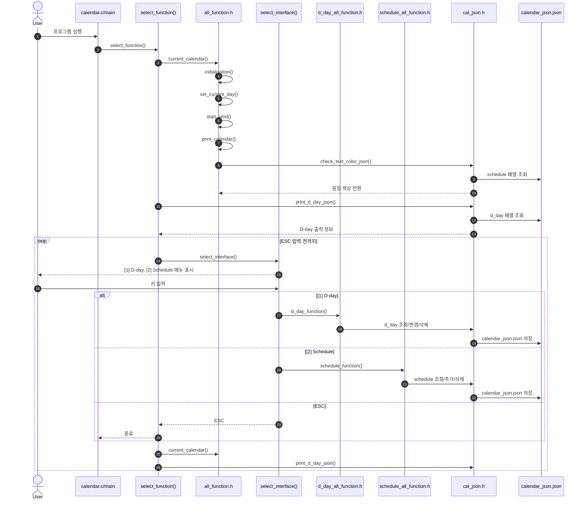
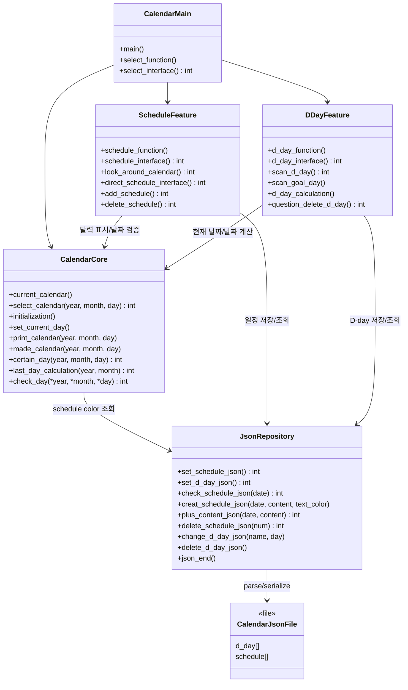

# 전체적인 흐름도

## Sequence Diagram

```mermaid
sequenceDiagram
    autonumber
    actor User
    participant Main as calendar.c/main
    participant App as select_function()
    participant Calendar as all_function.h
    participant Menu as select_interface()
    participant DDay as d_day_all_function.h
    participant Schedule as schedule_all_function.h
    participant Json as cal_json.h
    participant File as calendar_json.json

    User->>Main: 프로그램 실행
    Main->>App: select_function()
    App->>Calendar: current_calendar()
    Calendar->>Calendar: initialization()
    Calendar->>Calendar: set_current_day()
    Calendar->>Calendar: start_ymd()
    Calendar->>Calendar: print_calendar()
    Calendar->>Json: check_text_color_json()
    Json->>File: schedule 배열 조회
    Json-->>Calendar: 일정 색상 반환
    App->>Json: print_d_day_json()
    Json->>File: d_day 배열 조회
    Json-->>App: D-day 출력 정보

    loop ESC 입력 전까지
        App->>Menu: select_interface()
        Menu-->>User: [1] D-day, [2] Schedule 메뉴 표시
        User->>Menu: 키 입력
        alt [1] D-day
            Menu->>DDay: d_day_function()
            DDay->>Json: d_day 조회/변경/삭제
            Json->>File: calendar_json.json 저장
        else [2] Schedule
            Menu->>Schedule: schedule_function()
            Schedule->>Json: schedule 조회/추가/삭제
            Json->>File: calendar_json.json 저장
        else ESC
            Menu-->>App: ESC
            App-->>Main: 종료
        end
        App->>Calendar: current_calendar()
        App->>Json: print_d_day_json()
    end
```

## Class Diagram

```mermaid
classDiagram
    class CalendarMain {
        +main()
        +select_function()
        +select_interface() int
    }

    class CalendarCore {
        +current_calendar()
        +select_calendar(year, month, day) int
        +initialization()
        +set_current_day()
        +print_calendar(year, month, day)
        +made_calendar(year, month, day)
        +certain_day(year, month, day) int
        +last_day_calculation(year, month) int
        +check_day(*year, *month, *day) int
    }

    class ScheduleFeature {
        +schedule_function()
        +schedule_interface() int
        +look_around_calendar() int
        +direct_schedule_interface() int
        +add_schedule() int
        +delete_schedule() int
    }

    class DDayFeature {
        +d_day_function()
        +d_day_interface() int
        +scan_d_day() int
        +scan_goal_day()
        +d_day_calculation()
        +question_delete_d_day() int
    }

    class JsonRepository {
        +set_schedule_json() int
        +set_d_day_json() int
        +check_schedule_json(date) int
        +creat_schedule_json(date, content, text_color)
        +plus_content_json(date, content) int
        +delete_schedule_json(num) int
        +change_d_day_json(name, day)
        +delete_d_day_json()
        +json_end()
    }

    class CalendarJsonFile {
        <<file>>
        d_day[]
        schedule[]
    }

    CalendarMain --> CalendarCore
    CalendarMain --> ScheduleFeature
    CalendarMain --> DDayFeature
    CalendarCore --> JsonRepository : schedule color 조회
    ScheduleFeature --> CalendarCore : 달력 표시/날짜 검증
    ScheduleFeature --> JsonRepository : 일정 저장/조회
    DDayFeature --> CalendarCore : 현재 날짜/날짜 계산
    DDayFeature --> JsonRepository : D-day 저장/조회
    JsonRepository --> CalendarJsonFile : parse/serialize
```

