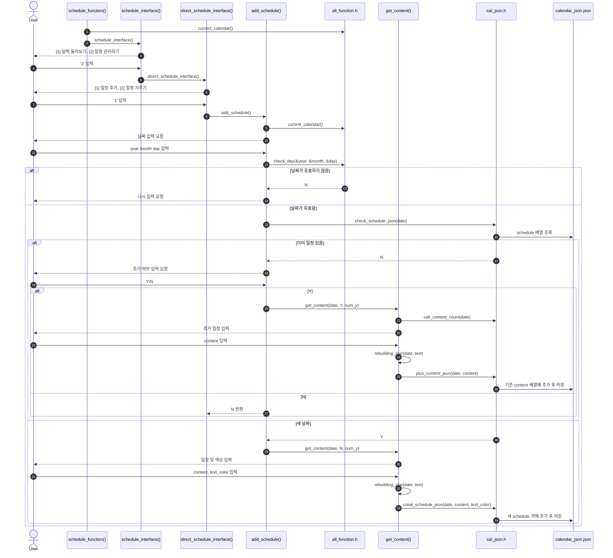
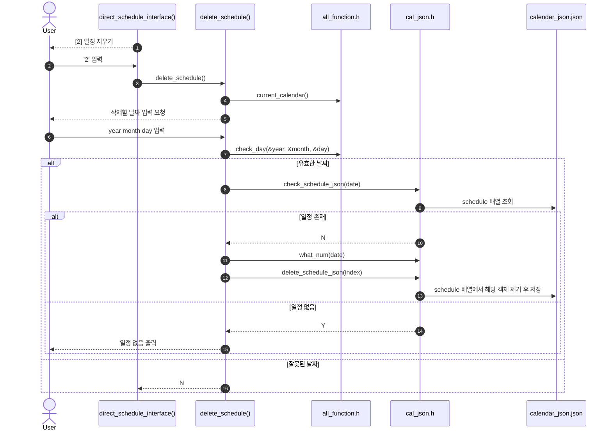
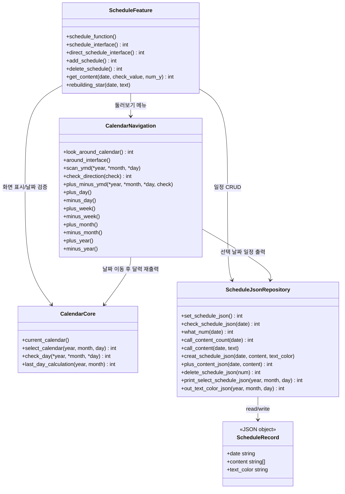

# 일정 관리

## Sequence Diagram: 일정 추가

```mermaid
sequenceDiagram
    autonumber
    actor User
    participant Schedule as schedule_function()
    participant Menu as schedule_interface()
    participant Direct as direct_schedule_interface()
    participant Add as add_schedule()
    participant Calendar as all_function.h
    participant Content as get_content()
    participant Json as cal_json.h
    participant File as calendar_json.json

    Schedule->>Calendar: current_calendar()
    Schedule->>Menu: schedule_interface()
    Menu-->>User: [1] 달력 둘러보기, [2] 일정 관리하기
    User->>Menu: '2' 입력
    Menu->>Direct: direct_schedule_interface()
    Direct-->>User: [1] 일정 추가, [2] 일정 지우기
    User->>Direct: '1' 입력
    Direct->>Add: add_schedule()

    Add->>Calendar: current_calendar()
    Add-->>User: 날짜 입력 요청
    User->>Add: year month day 입력
    Add->>Calendar: check_day(&year, &month, &day)

    alt 날짜가 유효하지 않음
        Calendar-->>Add: N
        Add-->>User: 다시 입력 요청
    else 날짜가 유효함
        Add->>Json: check_schedule_json(date)
        Json->>File: schedule 배열 조회
        alt 이미 일정 있음
            Json-->>Add: N
            Add-->>User: 추가 여부 입력 요청
            User->>Add: Y/N
            alt Y
                Add->>Content: get_content(date, Y, num_y)
                Content->>Json: call_content_count(date)
                Content-->>User: 추가 일정 입력
                User->>Content: content 입력
                Content->>Content: rebuilding_star(date, text)
                Content->>Json: plus_content_json(date, content)
                Json->>File: 기존 content 배열에 추가 후 저장
            else N
                Add-->>Direct: N 반환
            end
        else 새 날짜
            Json-->>Add: Y
            Add->>Content: get_content(date, N, num_y)
            Content-->>User: 일정 및 색상 입력
            User->>Content: content, text_color 입력
            Content->>Content: rebuilding_star(date, text)
            Content->>Json: creat_schedule_json(date, content, text_color)
            Json->>File: 새 schedule 객체 추가 후 저장
        end
    end
```

## Sequence Diagram: 일정 삭제

```mermaid
sequenceDiagram
    autonumber
    actor User
    participant Direct as direct_schedule_interface()
    participant Delete as delete_schedule()
    participant Calendar as all_function.h
    participant Json as cal_json.h
    participant File as calendar_json.json

    Direct-->>User: [2] 일정 지우기
    User->>Direct: '2' 입력
    Direct->>Delete: delete_schedule()
    Delete->>Calendar: current_calendar()
    Delete-->>User: 삭제할 날짜 입력 요청
    User->>Delete: year month day 입력
    Delete->>Calendar: check_day(&year, &month, &day)
    alt 유효한 날짜
        Delete->>Json: check_schedule_json(date)
        Json->>File: schedule 배열 조회
        alt 일정 존재
            Json-->>Delete: N
            Delete->>Json: what_num(date)
            Delete->>Json: delete_schedule_json(index)
            Json->>File: schedule 배열에서 해당 객체 제거 후 저장
        else 일정 없음
            Json-->>Delete: Y
            Delete-->>User: 일정 없음 출력
        end
    else 잘못된 날짜
        Delete-->>Direct: N
    end
```

## Class Diagram

```mermaid
classDiagram
    class ScheduleFeature {
        +schedule_function()
        +schedule_interface() int
        +direct_schedule_interface() int
        +add_schedule() int
        +delete_schedule() int
        +get_content(date, check_value, num_y) int
        +rebuilding_star(date, text)
    }

    class CalendarNavigation {
        +look_around_calendar() int
        +around_interface()
        +scan_ymd(*year, *month, *day)
        +check_direction(check) int
        +plus_minus_ymd(*year, *month, *day, check)
        +plus_day()
        +minus_day()
        +plus_week()
        +minus_week()
        +plus_month()
        +minus_month()
        +plus_year()
        +minus_year()
    }

    class CalendarCore {
        +current_calendar()
        +select_calendar(year, month, day) int
        +check_day(*year, *month, *day) int
        +last_day_calculation(year, month) int
    }

    class ScheduleJsonRepository {
        +set_schedule_json() int
        +check_schedule_json(date) int
        +what_num(date) int
        +call_content_count(date) int
        +call_content(date, text)
        +creat_schedule_json(date, content, text_color)
        +plus_content_json(date, content) int
        +delete_schedule_json(num) int
        +print_select_schedule_json(year, month, day) int
        +out_text_color_json(year, month, day) int
    }

    class ScheduleRecord {
        <<JSON object>>
        +date string
        +content string[]
        +text_color string
    }

    ScheduleFeature --> CalendarCore : 화면 표시/날짜 검증
    ScheduleFeature --> ScheduleJsonRepository : 일정 CRUD
    ScheduleFeature --> CalendarNavigation : 둘러보기 메뉴
    CalendarNavigation --> CalendarCore : 날짜 이동 후 달력 재출력
    CalendarNavigation --> ScheduleJsonRepository : 선택 날짜 일정 출력
    ScheduleJsonRepository --> ScheduleRecord : read/write
```

